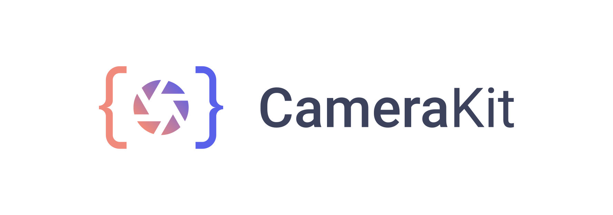

    

    
    

# What is CameraKit?

CameraKit takes one of the hardest Android APIs and makes it into a high level and easy to use library that solves all of your problems. This is the repository for the CameraKit Project's Website. We ue this as our central open-source website which anyone can contribute to, log bugs for, and help improve.

## Sponsors

## Run Development Environment

1. `yarn install`
2. `yarn dev`

## Detailed Documentation

To check out detailed docs for CameraKit, visit our [Documentation Website](http://docs.camerakit.website)

## License

CameraKit Website is [MIT License](https://github.com/CameraKit/CameraKit-Android/blob/master/LICENSE)
