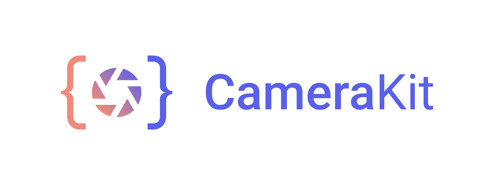

    

    
    

    

CameraKit takes one of the hardest Android APIs and makes it into a high level and easy to use library that solves all of your problems. This is the repository for the CameraKit Project's website. We ue this as our central open-source website which anyone can contribute to, log bugs for, and help improve.

## Supported by these Awesome Services

## Sponsors

### How to run
1. `yarn install`
2. `yarn server-dev`

## License
CameraKit Website is [MIT License](https://github.com/CameraKit/CameraKit-Android/blob/master/LICENSE)

